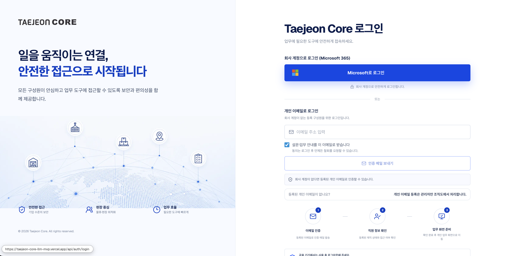
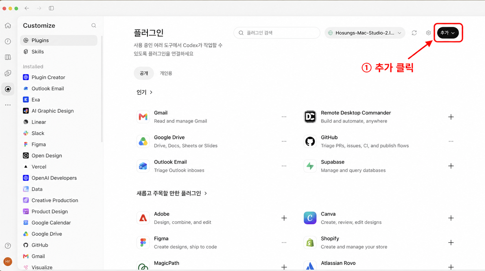
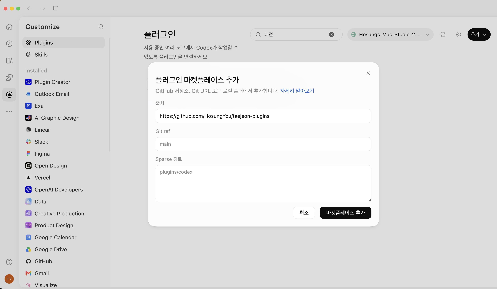
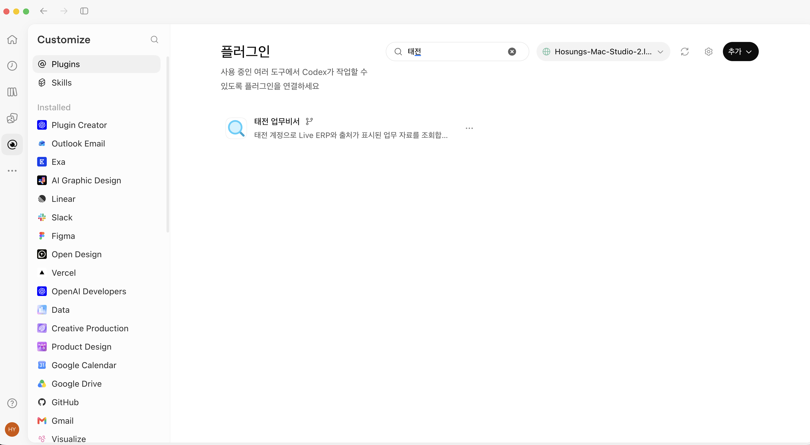
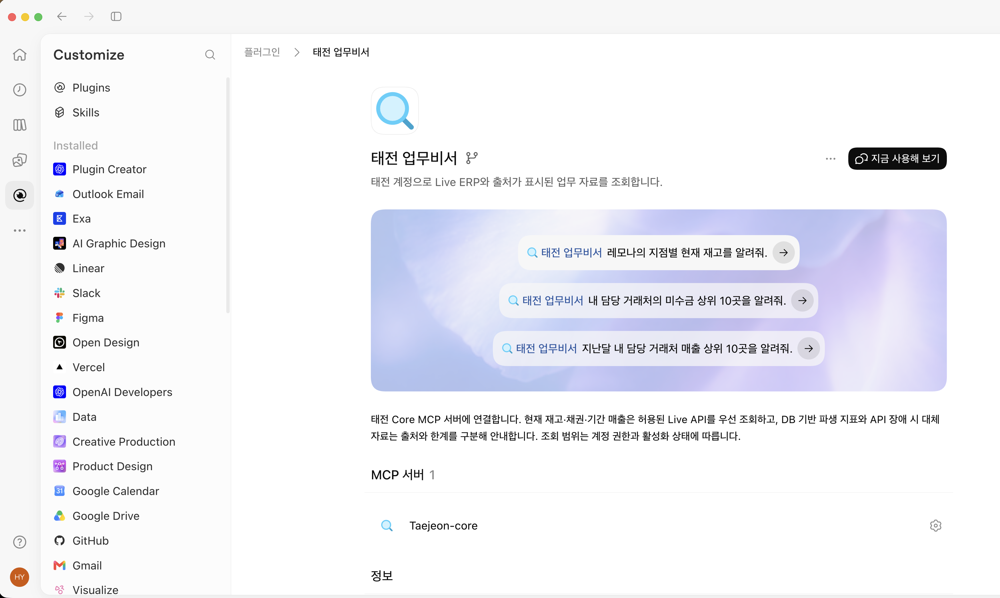
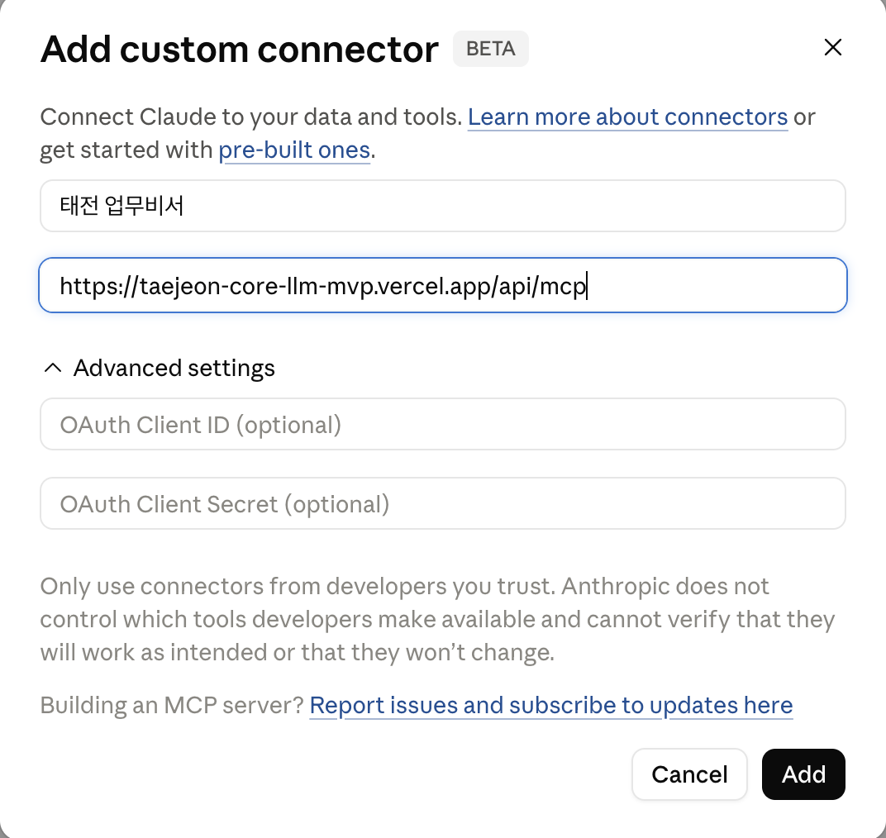
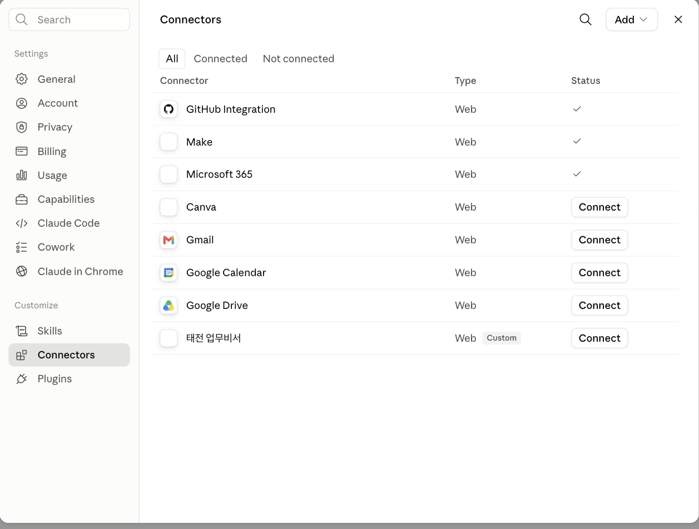

# 태전 업무비서 연결 가이드

태전그룹 전 직원이 각자의 Claude·ChatGPT 계정에서 플러그인을 사용하고, **본인의 태전 회사 계정으로 인증**해 업무 데이터를 조회합니다. 설치부터 첫 질문까지 아래 순서대로 따라 하세요.

이 공개 저장소에는 설치 설정·연결 안내·패키지 검증 코드가 있습니다. 검증 코드는 개발·CI용이며 설치되는 플러그인의 실행 hook이 아닙니다. Core 애플리케이션 소스, 직원·거래처 데이터, 인증 토큰은 포함하지 않습니다.

## 어떤 안내를 따라야 하나요?

| 사용하는 환경 | 따라 할 안내 | 입력하는 주소 |
| --- | --- | --- |
| ChatGPT·Codex 데스크톱 앱 — **마켓플레이스 추가** 메뉴가 있음 | [앱에서 설치하기](#chatgptcodex-데스크톱-앱에서-설치하기) | GitHub 저장소 주소 |
| Claude 웹·데스크톱 | [Claude에서 연결하기](#claude에서-연결하기) | Core MCP 서버 주소 |
| ChatGPT 웹 브라우저 — **MCP 앱 만들기** 메뉴 | [웹에서 직접 연결하기](#chatgpt-웹에서-직접-연결하기) | Core MCP 서버 주소 |

> **앱의 Git 설치와 웹의 MCP 등록은 서로 다른 절차입니다.** 아래 안내는 실제 **데스크톱 앱** 화면을 기준으로 합니다. 웹에서 같은 Git 입력 창을 찾을 필요는 없습니다.

## 시작하기 전에

- 태전 회사 계정과 Microsoft 로그인에 필요한 추가 인증 수단을 준비합니다.
- 본인이 사용하는 Claude·ChatGPT 계정으로 시작합니다. 회사 자료 조회에는 별도로 태전 회사 계정 인증이 필요하며, 조회 결과는 해당 AI 서비스의 대화에 전달됩니다.
- 앱을 설치했다고 Core 권한이 생기지는 않습니다. 사용 가능한 자료와 도구는 Core의 계정 권한·활성화 상태에 따라 달라집니다.
- 이미 태전 업무비서가 설치돼 있다면 다시 설치하지 말고 [3단계](#3단계--서버를-확인하고-새-대화에서-사용하기)부터 확인하세요.

## 공통 필수 단계 — 태전 Core에서 본인 인증과 권한 확인

**ChatGPT나 Claude에 로그인하거나 플러그인을 설치하는 것만으로는 태전 회사 데이터에 접근할 수 없습니다.** 두 앱 모두 태전 Core의 인증 절차를 거쳐야 하며, Core가 확인한 본인의 조회 권한 안에서만 자료를 제공합니다.

| 단계 | 무엇을 확인하나요? |
| --- | --- |
| ChatGPT·Claude 계정 로그인 | 사용 중인 AI 서비스의 계정입니다. 태전 데이터 조회 권한을 부여하지 않습니다. |
| 플러그인 설치·연결 등록 | 태전 Core에 연결할 설정을 추가합니다. 아직 회사 데이터 접근 승인이 아닙니다. |
| **태전 회사 계정 인증** | 연결·인증 요청에서 **본인의 Microsoft 365 회사 계정**으로 로그인합니다. |
| **Core의 권한 확인** | 현재 구성원 상태와 조회 권한을 서버가 검사합니다. 로그인에 성공해도 권한 밖 자료는 조회할 수 없습니다. |
| 앱으로 돌아가 실제 조회 | 인증을 마친 뒤 ChatGPT·Claude의 새 대화에서 태전 업무비서를 선택해 조회합니다. |



**이 가이드에서는 화면 위쪽의 파란색 ‘Microsoft로 로그인’ 버튼을 사용합니다.** 위 이미지는 태전 Core 로그인 화면의 예시이며, 외부 AI의 연결 과정에서는 Microsoft 로그인 화면으로 바로 이동할 수도 있습니다. Microsoft Authenticator·생체 인증·일회용 코드가 요청되면 본인이 완료하세요.

이미 Core 홈페이지에 로그인돼 있더라도 **ChatGPT·Claude에서 시작한 연결 인증 흐름이 완료됐는지** 확인해야 합니다. 별도 탭에서 Core 홈페이지에 로그인한 것만으로 AI 앱의 연결까지 완료된 것은 아닙니다.

인증 또는 권한 오류가 나면 [Core 연결 안내](https://taejeon-core-llm-mvp.vercel.app/me/mcp)에서 본인 상태를 확인하고 관리자에게 문의하세요. 비밀번호·토큰·인증 코드를 AI 대화창이나 공개 GitHub 이슈에 붙여 넣지 마세요.

## MCP로 조회할 수 있는 데이터

**조회 권한의 기준은 태전 Core에서 본인에게 허용된 범위입니다.** 플러그인을 설치해도 다른 사람·부서·법인의 권한을 추가로 얻지 않습니다. Core 화면의 모든 기능이 외부 AI에 그대로 제공되는 것은 아니며, 아래 MCP 도구가 제공하는 자료만 조회할 수 있습니다.

Core MCP 0.2.0 / 플러그인 1.0.3 기준 범위입니다. Live 도구는 연결된 활성 구성원에게 공개되며, 실제 자료 조회는 업무별 읽기 권한과 운영 활성화 상태를 확인합니다.

| 자료 | 조회 내용 | 출처·범위에서 주의할 점 |
| --- | --- | --- |
| 거래처·약국 기본정보 | 거래처 이름·코드, 주소·우편번호·전화번호 등 | Live 활성화 계정에서 주소·전화번호 조회. 비어 있는 값은 미확인 |
| 품목·재고 | 품목 검색·이름, 지점/센터별 현재고, DB 기반 보유·가용 수량 | Live 현재고와 DB 가용 수량은 다른 지표. 서로 다른 품목의 수량을 단위 확인 없이 합치지 않음 |
| 매출 | 권한 내 거래처의 기간별 매출원장·품목/전표 명세·집계, DB 매출 요약 | Live와 DB의 기준시각·기간·완전성 구분 |
| 미수·채권 | 현재 잔고·회전일·여신 한도 및 관련 DB 지표 | 서버가 허용한 거래처와 회계 범위 안에서 조회 |
| 주문·출고·배송 | 주문 내역·상태, 출고 행·수량·작업 단계, 지정 배송노선 | 지도·현재 위치·최적 방문 경로·기사 정보 조회를 뜻하지 않음 |
| 반품·거래 지표·품절 | 반품액·반품률·사유, 회전일·주문 공백 기반 지표, 품절 신호 | DB/공시 기반 지표를 실시간 ERP 값으로 해석하지 않음 |
| 내 등록 거래처·자료 안내 | Core에 등록한 거래처 중 조회 권한도 있는 목록, 자료 경로·법인/센터 안내 | 등록한 거래처라는 사실 자체가 매출·미수 조회 권한을 부여하지 않음 |

**기본 제공 범위에 포함하지 않는 항목**

- 직원 인사·급여·설문 응답·평가·OKR을 직접 조회하는 전용 도구는 현재 이 MCP 카탈로그에 등록돼 있지 않습니다.
- 원가·마진, 약사 이름·사업자등록번호 등은 현재 Live ERP 반환 필드 목록에 포함돼 있지 않습니다. 이것이 모든 원천·미래 확장까지 자동 차단한다는 의미는 아닙니다.
- 관리자용 회의 대장·지역 집계 등은 별도 활성화와 권한 조건을 가진 추가 기능입니다. 일반 직원에게 기본 제공되는 ERP 조회와 구분합니다.
- 회사 원장 수정·발주 실행·메일 발송 기능은 이 회사 데이터 플러그인의 제공 기능이 아닙니다. 다른 플러그인에서 제공하는 기능과 혼동하지 마세요.

**도구 공개와 데이터 읽기 범위는 별개입니다.** 재무 자료는 기존 담당·조직 범위 또는 최고관리자가 승인한 전사 전체열람 범위로 조회합니다. ERP 사번이나 기본 배정 거래처가 없어도 승인된 재무 전체열람은 적용됩니다. 사용 가능한 도구는 새 대화에서 “조회 가능한 업무 데이터와 기준시각을 알려줘”라고 질문하고 실제 도구 응답으로 확인하세요.

## 업데이트 후 사용하는 방법

이번 변경의 조회·권한 로직은 같은 Core MCP 서버 주소에 배포됩니다. 기존 플러그인 1.0.2도 같은 서버를 사용하므로, 기능 적용을 위해 제거·재설치를 할 필요는 없습니다. 플러그인 1.0.3은 갱신된 기능 설명과 이 안내를 포함합니다.

### ChatGPT

- 개발자 모드로 MCP를 직접 연결했다면 **Plugins → 태전 연결 → Refresh**를 선택하고, 도구 목록을 확인한 뒤 새 대화를 시작합니다.
- GitHub 마켓플레이스에서 설치했다면 플러그인 화면에서 마켓플레이스를 새로고침하고 태전 업무비서를 확인한 뒤 새 대화를 시작합니다. 앱이 갱신을 반영하지 않으면 앱을 다시 열어 확인합니다. 같은 마켓플레이스를 반복 추가하지 않습니다.
- 회사 인증 요청이 다시 나오면 본인 회사 계정으로 연결합니다. 권한 변경을 이유로 모든 직원의 연결을 폐기하거나 재인증을 강제하지 않습니다.

### Codex

Plugins에서 태전 마켓플레이스를 갱신한 뒤 새 채팅을 시작합니다. CLI를 사용하는 경우 현재 설치된 마켓플레이스를 확인하고 아래처럼 태전 출처를 갱신할 수 있습니다.

```sh
codex plugin marketplace list
codex plugin marketplace upgrade taejeon
```

앱에서 설치된 태전 업무비서가 켜져 있는지 확인하고 새 채팅에서 실제 조회를 실행합니다. 출처를 갱신하는 것만으로 회사 인증이 완료되는 것은 아닙니다.

공식 문서: [ChatGPT MCP 메타데이터 갱신](https://developers.openai.com/plugins/deploy/connect-chatgpt), [Codex 마켓플레이스 명령](https://learn.chatgpt.com/docs/developer-commands).

### 관리자가 읽기 범위를 조정하는 방법

[Core 데이터 접근 관리](https://taejeon-core-llm-mvp.vercel.app/admin/data-access)에서 구성원을 검색하고 **권한 조정**을 엽니다. **매출·이탈·반품**, **미수금·회전일**을 각각 기존 담당·조직 범위 또는 전사 전체열람으로 선택하고, 변경 전후와 사유를 확인해 저장합니다. 부여·회수는 최고관리자만 할 수 있습니다. 직급·보직의 자동 전체열람은 관리자 명시 부여와 구분해 표시됩니다.

개인은 [내 연결](https://taejeon-core-llm-mvp.vercel.app/me/connections)에서 기본 배정과 재무 읽기 범위, Live 사용 상태를 함께 확인할 수 있습니다. 기본 배정 0곳이 모든 재무 조회 불가를 뜻하지 않습니다.

## ChatGPT·Codex 데스크톱 앱에서 설치하기

화면 기준: **2026-09-29 사용자 제공 스크린샷**. 한국어 적용 후에도 `Customize`, `Plugins`, `Installed`, `Git ref` 등 일부 메뉴는 영어로 보일 수 있습니다.

### 1단계 — 태전 마켓플레이스 추가하기

앱 왼쪽의 **Plugins(플러그인)**을 엽니다. 아래 화면의 **오른쪽 위 검은색 ‘추가’ 버튼**을 누르고 **마켓플레이스 추가**를 선택합니다. 개별 플러그인 카드 옆의 `+` 버튼이 아닙니다.



*사용자 제공 화면에 안내용 테두리·화살표를 추가한 이미지입니다. [원본 화면](docs/images/chatgpt-desktop-00-add-original.png)도 함께 보관합니다.*

다음 창이 나오면 아래 사진처럼 **출처에 태전 GitHub 주소 전체를 입력**합니다.



| 화면에서 찾을 위치 | 입력·선택할 내용 | 확인할 점 |
| --- | --- | --- |
| **① 출처** — 창 중앙의 첫 번째 입력란 | 아래 GitHub 주소 전체를 붙여 넣기 | `/api/mcp` 주소를 넣는 곳이 아닙니다. |
| **② Git ref** — 출처 바로 아래 | `main` | 기본값이 이미 `main`이면 유지합니다. |
| **③ Sparse 경로** — 큰 입력란 | **비워 두기** | 회색 `plugins/codex`는 예시 문구입니다. 따라 입력하지 않습니다. |
| **④ 마켓플레이스 추가** — 창 오른쪽 아래 | 입력 확인 후 클릭 | 위 사진처럼 출처가 입력되면 오른쪽 아래 버튼으로 추가합니다. |

**출처에 붙여 넣을 주소**

```text
https://github.com/HosungYou/taejeon-plugins
```

**출처는 사진에 입력된 위 태전 GitHub 주소와 같아야 합니다.** 공용 비밀번호·토큰을 입력하거나 직원이 GitHub 저장소를 직접 복제할 필요는 없습니다.

> 마켓플레이스 추가는 **설치할 플러그인 목록을 가져오는 단계**입니다. 아직 태전 업무비서의 설치·회사 계정 인증까지 끝난 것은 아닙니다.

### 2단계 — 태전 업무비서 찾고 설치하기

마켓플레이스 추가 후 플러그인 목록으로 돌아옵니다. 상단 검색창에 **태전**을 입력합니다. `taejeon`으로 검색해도 됩니다.



| 화면에서 찾을 위치 | 할 일 |
| --- | --- |
| **① 상단 검색창** — 사진에서 `태전`이 입력된 곳 | `태전` 또는 `taejeon` 입력 |
| **② 검색창 오른쪽 기기 선택란** | 실제로 사용할 기기가 선택돼 있는지 확인. 사진의 기기 이름은 예시이며 그대로 맞출 필요가 없습니다. |
| **③ 검색 결과의 돋보기 아이콘과 ‘태전 업무비서’** | 해당 항목을 클릭해 상세 화면 열기 |
| **④ 상세 화면의 설치(Install)** | 처음 설치하는 경우 클릭. 이미 설치되어 ‘지금 사용해 보기’가 보이면 다음 단계로 이동 |

**검색 결과가 없다면:** 출처 주소를 확인한 뒤 기기 선택란 옆 **새로고침 아이콘**을 누릅니다. 그래도 보이지 않으면 앱을 다시 열어 확인합니다. 마켓플레이스를 같은 이름으로 반복 추가하거나 토큰을 수동으로 입력하지 마세요.

### 3단계 — 서버를 확인하고 새 대화에서 사용하기

설치된 태전 업무비서의 상세 화면입니다. 연결·인증 요청이 나오면 위 [태전 Core 인증 단계](#공통-필수-단계--태전-core에서-본인-인증과-권한-확인)를 완료합니다. **상단 ‘지금 사용해 보기’**와 **아래 ‘MCP 서버 1 → Taejeon-core’**를 확인합니다.



| 화면에서 찾을 위치 | 할 일 | 주의할 점 |
| --- | --- | --- |
| **① MCP 서버 1 → Taejeon-core** — 화면 아래쪽 | 태전 서버가 등록되어 있는지 확인 | 항목이 보이는 것만으로 인증 완료는 아닙니다. |
| **② Taejeon-core 오른쪽 톱니바퀴** | 연결 상태를 확인하고, 서버 사용 설정이 제공되면 켜져 있는지 확인 | 이 사진에는 상태창·켜짐 스위치가 펼쳐져 있지 않습니다. |
| **③ 지금 사용해 보기** — 화면 오른쪽 위 검은 버튼 | 새 대화에서 태전 업무비서 사용 시작 | 기존 대화에 도구가 보이지 않으면 새 대화를 엽니다. |
| **④ 가운데 예시 질문** | 원하는 질문을 선택하거나 아래 질문을 직접 입력 | 예시 문구는 실제 조회 결과가 아닙니다. |

연결·인증 요청이 표시되면 **본인의 태전 회사 계정**으로 로그인합니다. Microsoft Authenticator 승인, 일회용 코드, 생체 인증 등은 본인이 완료합니다. 비밀번호·인증 코드·토큰을 대화창에 붙여 넣지 마세요. 인증을 마치면 앱으로 돌아옵니다.

**첫 질문 예시**

```text
레모나의 지점별 현재 재고를 알려줘.
조회 결과의 출처와 기준시각도 함께 알려줘.
```

또는:

```text
조회 가능한 업무 데이터와 각 자료의 기준시각을 알려줘.
```

### 4단계 — 실제로 연결됐는지 확인하기

다음 세 가지를 구분해서 확인합니다.

| 확인 단계 | 확인 방법 |
| --- | --- |
| 설치 | 태전 업무비서 상세 화면이 열리고 MCP 서버가 표시됨 |
| 인증 | 회사 계정 로그인 후 연결 오류 없이 앱으로 돌아옴 |
| 조회 | 새 대화에서 실제 태전 도구가 실행되고 결과 또는 권한·자료 부재에 대한 구체적 응답이 돌아옴 |

답변에 **자료의 출처·조회시각·원천 기준시각·부분 결과 여부**가 있는지 확인하세요. Live API 결과인지 DB 대체 자료인지도 확인합니다. 오류나 자료가 없다는 답변을 숫자 0으로 해석하면 안 됩니다.

> 위 스크린샷은 마켓플레이스 입력 창·검색 결과·설치된 상세 화면을 설명합니다. **회사 계정 인증 완료나 실제 업무 조회 성공의 증거 사진은 아닙니다.** 결과 화면에 회사 자료가 포함될 수 있으므로 공개 README에 실제 거래처·직원 자료를 올리지 않습니다.

## Claude에서 연결하기

이미 Claude에 연결했다면 중복 추가하지 말고 새 대화에서 태전 업무비서를 선택해 조회합니다.

### 1. 커넥터 추가 창 열기

**Settings → Connectors → Add → Add custom connector**를 엽니다. 이름은 **태전 업무비서**, Remote MCP server URL은 아래 주소로 입력합니다.

```text
https://taejeon-core-llm-mvp.vercel.app/api/mcp
```



일반 직원은 **OAuth Client ID / Client Secret을 직접 입력하지 않습니다.** 이름과 서버 주소를 확인하고 **Add**를 누릅니다. 이 칸에 GitHub 마켓플레이스 주소를 넣지 마세요.

### 2. 회사 계정으로 연결하고 새 대화 시작하기

목록에서 **태전 업무비서 오른쪽 Connect**를 누르고 본인의 회사 계정으로 로그인합니다. Microsoft 추가 인증을 마친 후 **새 대화**에서 태전 업무비서를 선택하고 첫 질문을 입력합니다.



Claude 이미지는 기존 Core 안내의 **2026년 7월 화면**입니다. 메뉴 배치는 버전에 따라 다를 수 있습니다. 목록의 Connect는 연결을 시작하는 버튼이며 연결 완료 표시가 아닙니다. 조회 성공 기준은 위 [4단계](#4단계--실제로-연결됐는지-확인하기)와 같습니다.

## ChatGPT 웹에서 직접 연결하기

**아래는 브라우저용 대체 경로입니다. 위 데스크톱 앱의 Git 마켓플레이스 설치와 섞어 진행하지 마세요.**

2026-09-29 로그인된 한국어 웹 화면에서 **플러그인 → 추가 → MCP 앱 만들기** 입력 창을 확인했습니다.

1. 사이드바의 **플러그인**을 엽니다. 설정에서 시작했다면 **플러그인 → 디렉터리 둘러보기**를 누릅니다.
2. **추가 → MCP 앱 만들기**를 선택합니다.
3. 이름에 **태전 업무비서**, **연결 → 서버 URL**에 위 Core `/api/mcp` 주소를 입력합니다.
4. 인증은 **OAuth**를 사용합니다. 화면의 연결 대상과 위험 안내를 확인한 후 생성·회사 계정 인증을 진행합니다.
5. 새 대화에서 연결을 선택해 실제 조회를 확인합니다.

메뉴 제공 여부는 계정·워크스페이스 정책에 따라 다릅니다. 공식 문서는 **설정 → 보안 및 로그인 → 개발자 모드** 경로도 안내합니다. 관리자는 필요한 경우 정확한 ChatGPT OAuth 콜백 주소가 Core에서 허용되어 있는지 확인해야 합니다. 이 README의 데스크톱 스크린샷은 웹 등록 화면을 설명하지 않습니다.

[OpenAI 공식 MCP 연결 안내](https://developers.openai.com/plugins/deploy/connect-chatgpt)

## 연결이 안 될 때

| 증상 | 확인할 내용 |
| --- | --- |
| `repository not found` | 앱 마켓플레이스 **출처**에 GitHub 주소를 넣었는지 확인 |
| 태전 검색 결과가 없음 | 마켓플레이스 추가 완료, 선택 기기, 목록 새로고침 확인 |
| 설치 대신 ‘지금 사용해 보기’가 보임 | 이미 설치된 상태일 수 있으므로 서버 연결 상태와 새 대화에서 확인 |
| 로그인 반복·권한 오류 | [Core 연결 안내](https://taejeon-core-llm-mvp.vercel.app/me/mcp)에서 본인 계정 상태 확인 |
| 새 도구가 대화에 안 보임 | 설치·재인증 후 새 대화를 열고 플러그인 선택 |
| Live 도구가 없음 | 해당 계정의 Live 활성화 여부를 Core 관리자에게 확인 |
| 조회 결과가 없거나 일부만 나옴 | 권한 범위, 조회 조건, 출처·기준시각·부분 결과 표시 확인 |

문제 제보에는 **사용한 앱, 오류 문구, 발생 시각, 어느 단계에서 멈췄는지**를 알려주세요. 비밀번호·토큰·인증 코드·회사 업무 데이터는 공개 GitHub 이슈에 올리지 않습니다.

## 보안과 조회 범위

- 서버는 HTTPS 원격 MCP이며 직원별 OAuth 로그인을 사용합니다. 공용 인증 토큰을 배포하지 않습니다.
- 플러그인의 Read 표시는 기능 설명입니다. 실제 신원·도구 입력·조회 권한은 Core 서버가 검사합니다.
- 권한 내 조회 결과의 저장·분석·후속 활용에 이 플러그인이 별도 제한을 추가하지 않습니다. 다른 서비스로의 자동 전송·자동 실행을 뜻하지는 않습니다. 연결 해제만으로 이미 대화에 반환된 데이터가 자동 삭제되는 것은 아닙니다.
- Live ERP는 계정별 활성화 대상입니다. API 장애 시 DB 대체 자료가 반환될 수 있으며 이를 실시간 값으로 해석하지 않습니다.
- 지도 링크·주변 약국·방문 경로 기능은 이 플러그인 안내의 제공 범위에 포함하지 않습니다.
- 이 가이드는 설치 안내이며 전체 보안 검증 통과나 모든 직원의 접근 가능성을 보증하지 않습니다.

## 배포 파일

- `.agents/plugins/marketplace.json`: 앱이 읽는 마켓플레이스 목록
- `plugins/taejeon-core/plugin.json`, `mcp.json`: Agent Plugins 1.0 형식
- `plugins/taejeon-core/.codex-plugin/plugin.json`, `.mcp.json`: 기존 Codex 클라이언트 호환 형식

두 형식은 같은 이름·버전·서버를 가리킵니다. 중복 서버를 별도로 등록할 필요는 없습니다.

[Core 연결 안내](https://taejeon-core-llm-mvp.vercel.app/me/mcp) · [OpenAI 플러그인 문서](https://developers.openai.com/plugins/build/plugins)


## 설치 패키지 검사

서버 주소·인증 헤더·실행 파일·두 manifest의 일치 여부를 [자동 검사](docs/security-controls.md)합니다. 이 검사의 통과가 Core 서버의 전체 보안 검증을 뜻하지는 않습니다.

## ERP 추출·복구 지침 변경안

1.1.0 소스에는 [ERP 추출 skill](plugins/taejeon-core/skills/erp-extraction/SKILL.md)이 포함됩니다. 파일 해석·분석·엑셀 생성은 ChatGPT/Codex가 맡고 태전 MCP는 권한 내 자료 발견·조회·복구·데이터 표상을 제공합니다. 원천 실패를 매출 0건으로 처리하지 않으며 실패 구간 재조회와 부분 결과를 구분합니다. 이 복구 계약은 Core MCP 0.3.0 이상에서 제공됩니다. [릴리스 변경안](docs/extraction-release-1.1.0.md)은 구현과 운영 반영을 구분합니다.
